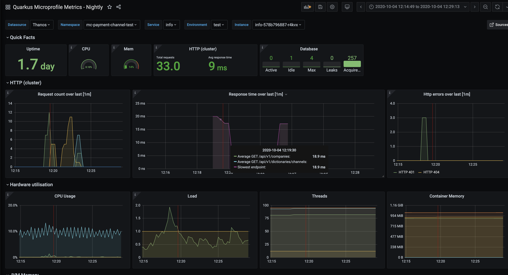

# Dashboard for Microprofile metrics exposed by Quarkus

Available panels:
- Uptime
- Hardware utilization: CPU, mem, threads
- HTTP counters and timers
- Database (Agroal): connection pool counters and timers
- JVM memory and Garbage Collectors

## Usage
1. Import `src/quarkus-microprofile-metrics.json` into your Grafana.
2. Adjust variable definitions (namespace, service etc) for your platform.
3. Enjoy!

## Starting local Grafana and Prometheus
1. Edit `prometheus/prometheus.yml` and add scrape targets (url to your running quarkus apps)
2. Run `docker-compose up -d`
3. Open `http://localhost:3000/` and use `admin:admin` credentials
4. Open `Quarkus Microprofile Metrics` dashboard